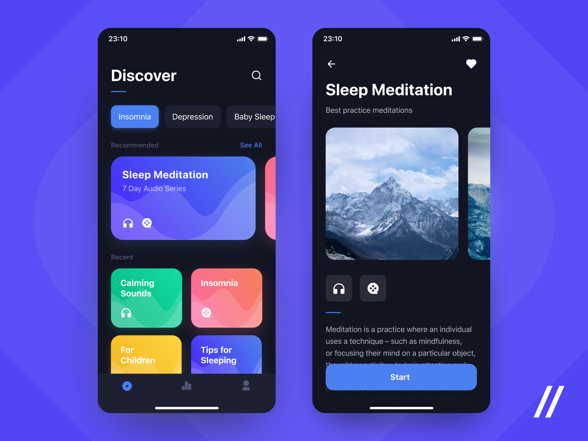
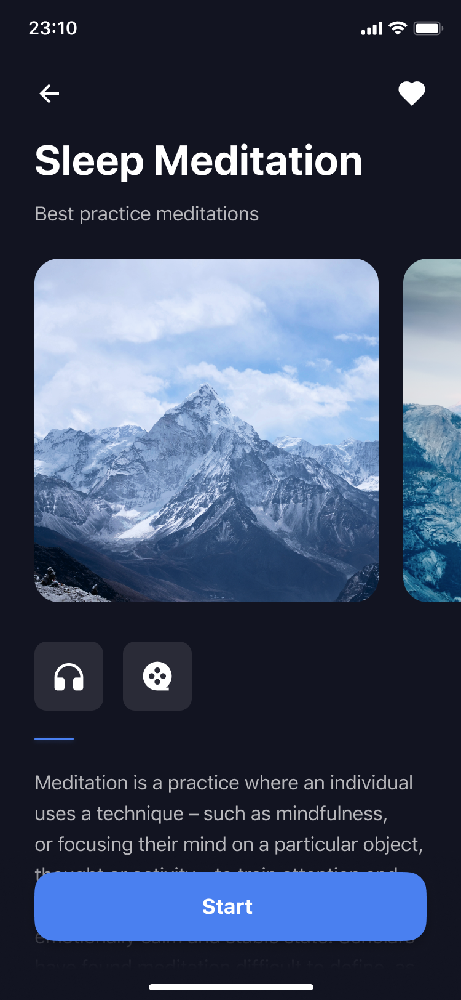
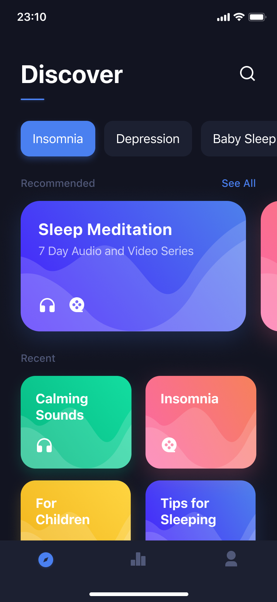

# Overview

This is one of my earliest Flutter projects. I built this in an attempt to copy the UI of [this Dribble mockup](https://dribbble.com/shots/6870298-Sleep-App).

## The front-end

 

# Source Material
Based on [this mock-up](https://dribbble.com/shots/6870298-Sleep-App)

  
  

## Notes

It should be noted that this project is very old and outdated. Most of the Flutter code uses depracated sytax and methods. This project is not connected to a back-end and is UI only.
